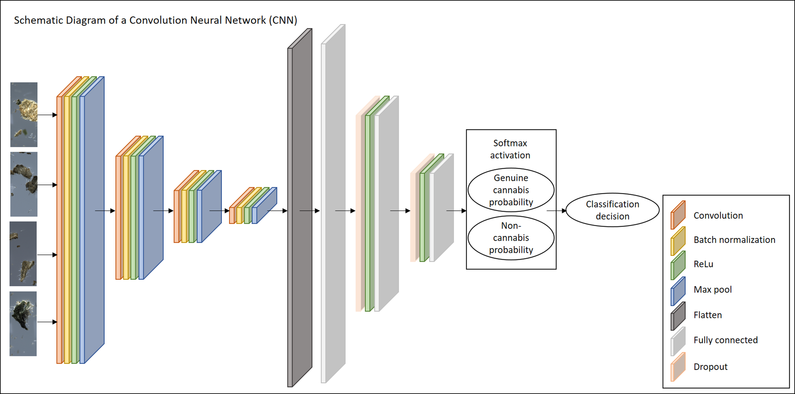
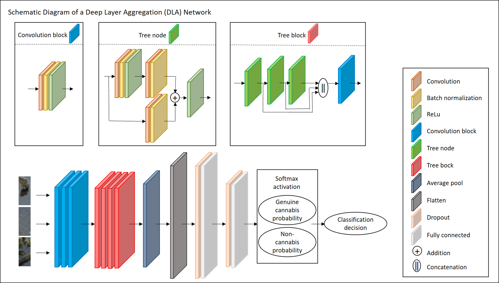

---

### **Cystolith Detection**

# Cystolith Detection: A Vision-Based Deep Learning Framework for Cannabis Identification

## Table of Contents
1. Introduction
2. Project Structure
3. Basic Classifiers: Overview and Usage
4. YOLO Object Detection: Training and Testing
5. DETR Object Detection: Training and Testing
6. Composite Methods
7. General Notes
8. Credits

## 1. Introduction

This repository hosts the source code and data for detecting genuine cannabis from non-cannabis plant materials using deep learning and computer vision techniques. 
Designed to aid forensic laboratories and law enforcement agencies, this project leverages advanced image analysis to distinguish genuine cannabis plants from illicit substitutes, such as synthetic cannabinoid-sprayed materials, with an accuracy exceeding 97%.

The project incorporates a pipeline of classifiers, object detectors (YOLO, DETR), and composite methods trained on thousands of annotated microscope images. 
It provides a scalable, cost-effective alternative to conventional tests, significantly reducing the time and resources required for forensic identification. 
All tools and configurations are made publicly available to ensure reproducibility and enable further research.

Figure - Samples of non-glandular trichome hairs in cannabis (left) and non-cannabis trichomes (right) from the dataset collected during this research.

Source code and configuration files are in the 'src' folder. 
The code contains:   
	1. Two different classifiers for whole images.  
	2. YOLO and DETR object detectors for trichome hair identification.  
	3. Two composite methods for classification, combining the object detectors and whole image and/or bounding box classification.

Images and annotations are in the 'data' folder.
Manual annotations of bonding boxes surrounding trichome hairs were obtained using MakeSense, freely available at https://www.makesense.ai/.  
Lists of images are in the  'src/image_lists' folder.
These contain two different splits of the images into train/validation/test partitions.
For usage, first clone this repository into your local 'cystolith_detection' directory.

## 2. Project Structure

* `src/`: Contains source code for classifiers, object detection models, and composite methods.
* `data/`: Includes the complete dataset - images and annotations used for training and testing.
* `data/image_lists/`: Contains train/validation/test partitions for the datasets.
*  Notes on file names and annotations:  
    All filenames containing 'C' refer to genuine cannabis; filenames containing 'S' refer to non-cannabis material.  
    Annotated bounding boxes of genuine cannabis are labeled '0'; non-cannabis are labeled '1'. 

## 3. Basic Classifiers: Overview and Usage

* Basic CNN (Convolutional Neural Network) is based on:  
	https://pytorch.org/tutorials/beginner/blitz/cifar10_tutorial.html  
	https://www.kaggle.com/code/shadabhussain/cifar-10-cnn-using-pytorch

* DLA (Deep Layer Aggregation) is based on:  
	https://github.com/kuangliu/pytorch-cifar/blob/master/models/dla.py  
	https://arxiv.org/abs/1707.06484

* Use the configuration files in \cystolith_detection\src\basic_classifiers\configs
* Use the image lists in \cystolith_detection\data\image_lists
* In the configuration file:
	1. Change the data->path field to your local directory containing the images.
	2. Change the train->out_dir field to your desired local directory for writing results.
	
* Small CNN training and testing:	
	python train.py --config configs/config_03_basic_cnn_split_1.yml    
	python test.py --config configs/config_03_basic_cnn_split_1.yml  

* DLA training and testing:
	python train.py --config configs/config_04_dla_split_1.yml   
	python test.py --config configs/config_04_dla_split_1.yml   

## 4. YOLO Object Detection: Training and Testing

* Installation and usage based on:  
	https://medium.com/p/61a659d4868#e5b4  
	https://github.com/AlexeyAB/darknet  
	https://arxiv.org/abs/2004.10934  
	
* YOLO training:

	1. Open file \cystolith_detection\src\yolov4\darknet\cfg\yolov4-custom.cfg
	2. Comment the lines "batch=1" and "subdivisions=1", and uncomment lines"#batch=64" and "#subdivisions=16" (lines 3,4 and 6,7)
	3. Open cmd from \cystolith_detection\src\yolov4\darknet
	4. Run command: darknet.exe detector train data/obj.data cfg/yolov4-custom.cfg yolov4/training/yolov4-custom_last.weights -map

* YOLO testing:

	1. Open file \cystolith_detection\src\yolov4\darknet\cfg\yolov4-custom.cfg
	2. Uncomment the lines "#batch=1" and "#subdivisions=1", and comment lines"batch=64" and "subdivisions=16" (lines 3,4 and 6,7)
	3. Open cmd from \cystolith_detection\src\yolov4\darknet
	4. Run command: py yolo_accuracy_check.py

## 5. DETR Object Detection: Training and Testing

* Installation and usage based on:  
	https://github.com/roboflow/notebooks/blob/main/notebooks/train-huggingface-detr-on-custom-dataset.ipynb  
	https://www.youtube.com/watch?v=AM8D4j9KoaU&t=619s  
	https://link.springer.com/chapter/10.1007/978-3-030-58452-8_13  

* DETR training + testing:

	1. Open cmd from \cystolith_detection\src\detr\model_DETR\detr_training_and_testing
	2. Run command: py detr_training.py

* DETR testing only:

	1. Open cmd from \cystolith_detection\src\detr\model_DETR\detr_testing_and_analyzing
	2. Run command: py detr_testing.py

* DETR analyzing:

	1. Open cmd from \cystolith_detection\src\detr\model_DETR\detr_testing_and_analyzing
	2. Run command: py detr_accuray_check.py

## 6. Composite Methods

* Create the bounding box dataset needed for training the composite 3-stage method:
	1. Train DETR with a lower threshold (see previous section), with CONFIDENCE_TRESHOLD = 0.1 in the detr_training.py file.  
	2. Run the classifier_bbx_to_images() function in src/basic_classifiers/utils.py to produce the bounding boxes images from DETR's classification.
	3. Run the create_yolo_detr_split_lists() function in src/basic_classifiers/utils.py to create lists of train/validation/test splits of the bounding box images.
	4. Train the DLA model on boundig boxes images, with the following command (similar to DLA training as described above):   
		python train.py --config configs/config_06_bbx_split_1.yml	
	5. Use the model trained on bounding boxes as part of the composite methods described below.

* Composite 2-stage and 3- stage methods:
    1. Open cmd from \cystolith_detection\src\composite_classifiers
    2. Select DETR or YOLO, and 2 or 3-stage method.   
       - 2-stage method - DETR --> DLA on whole images:  
       Run command: py final_method_detr_whole.py  
       - 3-stage method - DETR --> DLA on bounding boxes:  
       Run command: py final_method_detr_bb.py  
       - 2-stage method - YOLO --> DLA on whole images:  
       Run command: py final_method_yolo_whole.py  
       - 3-stage method - YOLO --> DLA on bounding boxes:          
       Run command: py final_method_yolo_bb.py  
    3. The output table with all detection info and predictions will be in folder \cystolith_detection\src\composite_classifiers\final_method_results

## 7. General Notes

* Update file paths to your local directories as required by individual scripts.  
* Ensure all dependencies are installed before running any script.
* The code has been run and tested on a Windows operating system using Python 3.8.10, PyTorch 1.8.0, and CUDA 10.1, on a system equipped with an NVIDIA GTX 1080Ti GPU.    

## 8. Credits

"Identification of Non-Glandular Trichome Hairs in Cannabis using Vision-Based Deep Learning Methods"  
Alon Zvirin1, Amitzur Shapira2, Emma Attal1, Tamar Gozlan1, Arthur Soussan1, Dafna De La Vega2, Yehudit Harush2, and Ron Kimmel1.  
1 Computer Science Department, Technion - Israel Institute of Technology. Haifa, Israel.  
2 The Division of Forensic Sciences, National Police Headquarters, Jerusalem, Israel.  
The paper will soon be published.  
Contact - alongitzv@gmail.com

